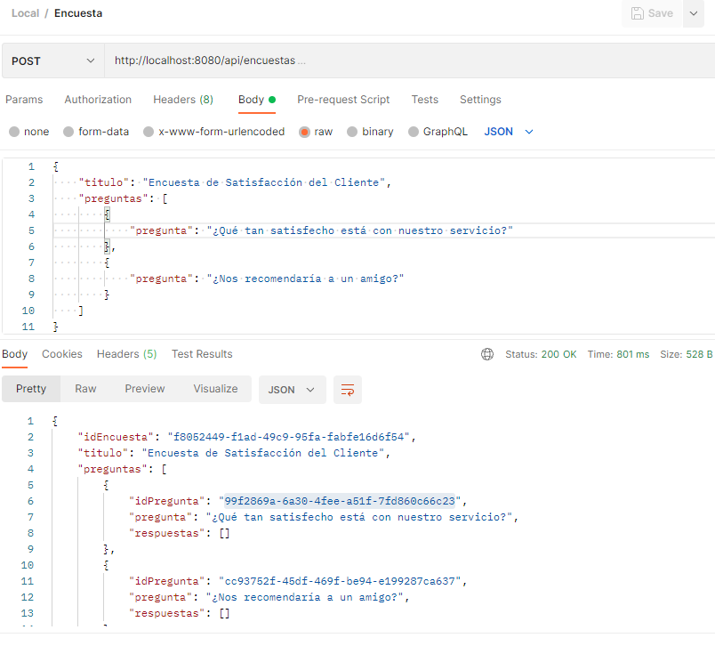
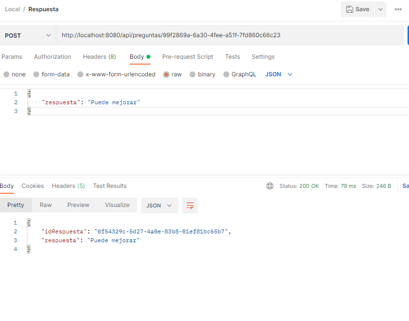
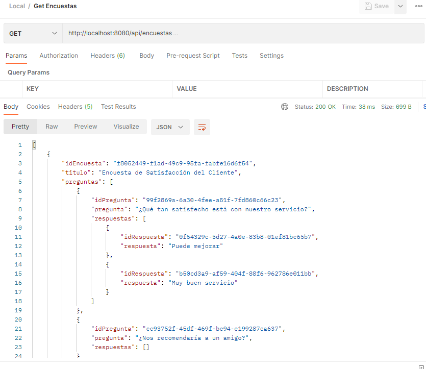

# Entrega JPA Application

This is a Spring Boot application for managing api/surveys, questions, and responses using JPA (Java Persistence API).







## Table of Contents
- [Getting Started](#getting-started)
- [Prerequisites](#prerequisites)
- [Installation](#installation)
- [Running the Application](#running-the-application)
- [Running Tests](#running-tests)
- [API Endpoints](#api-endpoints)
- [Contributing](#contributing)
- [License](#license)

## Getting Started

These instructions will help you set up and run the project on your local machine for development and testing purposes.

## Prerequisites

- Java 17 or higher
- Maven 3.6.0 or higher
- An IDE such as IntelliJ IDEA

## Installation

1. Clone the repository:
    ```sh
    git clone https://github.com/your-username/entrega-jpa.git
    cd entrega-jpa
    ```

2. Build the project using Maven:
    ```sh
    mvn clean install
    ```

## Running the Application

To run the application, use the following command:
```sh
mvn spring-boot:run
```

## Running Tests
```sh
mvn test
```

## API Endpoints

The application exposes the following endpoints:

- `GET /api/encuestas`: Get all surveys
- `POST /api/encuestas`: Create a new survey
- `PUT /api/encuestas/{surveyId}`: Update a survey
- `DELETE /api/encuestas/{surveyId}`: Delete a survey
- `POST /api/preguntas/{idQuestion}`: Create a new response for a question

## Contributing

- Fork the repository
- Create a feature branch (`git checkout -b feature/fooBar`)
- Commit your changes (`git commit -am 'Add some fooBar'`)
- Push to the branch (`git push origin feature/fooBar`)
- Create a new Pull Request

## License

This project is licensed under the MIT License

